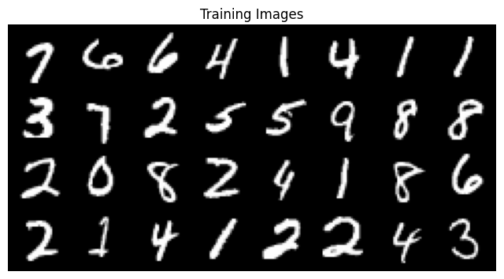
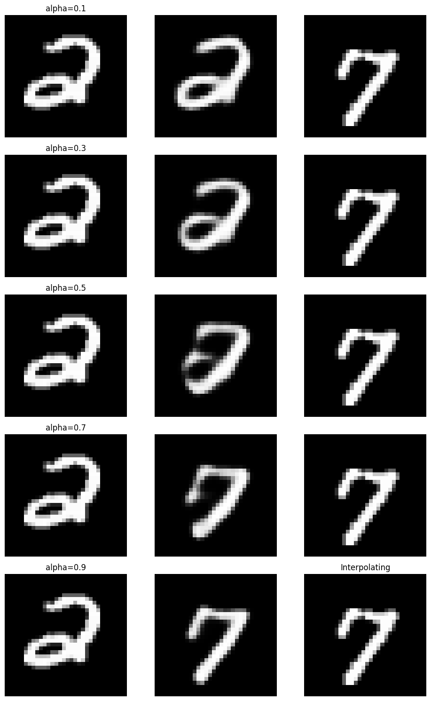
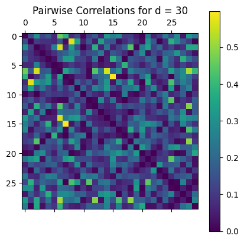
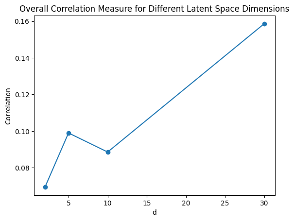

# Tutorial
In this notebook we will perform an convolution autoencoder with different layers, and test it over the **MNIST** dataset to observe how different architectures affects the accuracy and result of the model.


An **autoencoder** is a type of **artificial neural network** used to learn efficient codings of unlabeled data (unsupervised learning). An autoencoder learns two functions: an encoding function that transforms the input data, and a decoding function that recreates the input data from the encoded representation. The autoencoder learns an **efficient representation** (encoding) for a set of data, typically for dimensionality reduction.


```python
pip install wandb
```

We will be using torchvision libarary and using matplotlib and wandb to to see results


```python
import torch
import torchvision
import torchvision.transforms as transforms
import wandb
import tensorflow as tf
import torch.nn as nn
import torch.nn.functional as F
import matplotlib.pyplot as plt
import numpy as np
import torch.optim as optim
```

Now we will set up our model and train loader of the MNIST dataset and show some trainig samples


```python
import torchvision.utils as vutils
Transform = transforms.Compose([transforms.ToTensor()])
device = torch.device('cuda:0' if torch.cuda.is_available() else 'cpu')

batch_size = 32

trainset = torchvision.datasets.MNIST(root='./data', train=True,
                                        download=True, transform=Transform)
trainloader = torch.utils.data.DataLoader(trainset, batch_size=batch_size,
                                          shuffle=True, num_workers=2)

testset = torchvision.datasets.MNIST(root='./data', train=False,
                                       download=True, transform=Transform)
testloader = torch.utils.data.DataLoader(testset, batch_size=batch_size,
                                         shuffle=False, num_workers=2)

# Plot some training images
real_batch = next(iter(trainloader))
plt.figure(figsize=(8,8))
plt.axis("off")
plt.title("Training Images")
plt.imshow(np.transpose(vutils.make_grid(real_batch[0].to(device)[:64], padding=2, normalize=True).cpu(),(1,2,0)))

```


    <matplotlib.image.AxesImage at 0x7ec5263d6230>


    

    


Now we will define in **sepereate** our AutoEncoder and decoder networks


```python
import torch.nn as nn

class Encoder(nn.Module):
    def __init__(self, latent_dim):
        super(Encoder, self).__init__()
        self.latent_dim = latent_dim
        self.conv1 = nn.Conv2d(1, 16, kernel_size=3, stride=2, padding=1) # 32 x 32 -> 32-1/2 + 1 = 16x16
        self.conv2 = nn.Conv2d(16, 32, kernel_size=3, stride=2, padding=1) # 16x16 -> 16-1/2 + 1 = 8x8
        self.conv3 = nn.Conv2d(32, 64, kernel_size=3, stride=2, padding=1) # 8x8 -> 8-1/2 + 1 = 4x4
        self.fc = nn.Linear(64 * 4 * 4, latent_dim) #
        self.relu = nn.ReLU()

    def forward(self, x):
        # print(x.shape)
        x = self.relu(self.conv1(x))
        # print(x.shape)
        x = self.relu(self.conv2(x))
        # print(x.shape)
        x = self.relu(self.conv3(x))
        # print(x.shape)
        x = x.view(-1, 64 * 4 * 4)
        # print(x.shape)
        x = self.fc(x)
        return x

```


```python
class Decoder(nn.Module):
    def __init__(self, latent_dim):
        super(Decoder, self).__init__()
        self.latent_dim = latent_dim
        self.fc = nn.Linear(latent_dim, 64 * 4 * 4)
        self.deconv1 = nn.ConvTranspose2d(64, 32, kernel_size=4, stride=2, padding=1)
        self.deconv2 = nn.ConvTranspose2d(32, 16, kernel_size=4, stride=2, padding=1)
        self.deconv3 = nn.ConvTranspose2d(16, 1, kernel_size=4, stride=2, padding=1)
        self.sigmoid = nn.Sigmoid()
        self.relu = nn.ReLU()

    def forward(self, x):
        # print(x.shape)
        x = self.fc(x)
        x = x.view(-1, 64, 4, 4)
        # print(x.shape)
        x = self.relu(self.deconv1(x))
        # print(x.shape)
        x = self.relu(self.deconv2(x))
        # print(x.shape)
        x = self.sigmoid(self.deconv3(x))
        # print(x.shape)
        return x

```

Now we will define our Autoencoder :


```python
class Autoencoder(nn.Module):
    def __init__(self, d):
        super(Autoencoder, self).__init__()
        self.encoder = Encoder(d)
        self.decoder = Decoder(d)

    def forward(self, x):
        x = self.encoder(x)
        x = self.decoder(x)
        return x

```

We will be using different loss function such as MSELoss, and will be using different sizes of latents spaces in order to investigate which dimension will result in great accuracy but also in effiency. Using **ADAM** optimizer should give us best results.


```python

device = torch.device('cuda:0' if torch.cuda.is_available() else 'cpu')
LEARNING_RATE = 0.001

criterion = nn.MSELoss()
autoencoder = Autoencoder(d=30).to(device)
optimizer = optim.Adam(autoencoder.parameters(), lr=0.001)
import multiprocessing
multiprocessing.set_start_method('spawn', True)

```


```python
from google.colab import drive
drive.mount('/content/drive')
```

    Mounted at /content/drive


In this code section we will perform the training part of our auto encdoer we define before by using gradient decent method using learning rate 0.001


```python
import torch
import torch.nn as nn
import torch.optim as optim
from torchvision.datasets import MNIST
from torchvision.transforms import ToTensor
from torch.utils.data import DataLoader

# Define hyperparameters
learning_rate = 0.001
num_epochs = 5
epochs_loss = []
# wandb.login()
wandb.init(project="emnist",)
# Train loop
for epoch in range(num_epochs):
    running_loss = 0.0
    for batch_idx, (data, _) in enumerate(trainloader):
        # print(len(trainloader), len(trainloader) / batch_size)
        optimizer.zero_grad()
        data  = data.to(device)
        data = F.pad(data, pad=(2, 2, 2, 2), mode='constant', value=0) # Padding input image from 28x28 -> 32x32
        # Forward pass
        recon = autoencoder(data)
        loss = criterion(recon, data)
        images_ = wandb.Image(data, caption="Top: Output, Bottom: Input")
        wandb.log({"Original images": images_, 'num iter': batch_idx})

        reconsturction_images = wandb.Image(recon, caption="Top: Output, Bottom: Input")
        wandb.log({"reconsturction images": reconsturction_images})
        # Backward pass and optimization step
        loss.backward()
        optimizer.step()

        running_loss += loss.item()
        if batch_idx % 100 == 99:    # print every 100 batches
            # print('[%d, %5d] loss: %.3f' % (epoch + 1, batch_idx + 1, loss.item() ))
            wandb.log({'Train loss' : loss.item()})
            running_loss = 0.0

    epoch_loss = running_loss / len(trainloader)
    epochs_loss.append(epoch_loss)
    # print('Epoch %d loss: %.3f' % (epoch + 1, epoch_loss))
    wandb.log({'Epoch loss' : epoch_loss,  'Epoch' : epoch})


torch.save(autoencoder.state_dict(), "conv_autoencoder.pth")
```


    <IPython.core.display.Javascript object>


    wandb: Logging into wandb.ai. (Learn how to deploy a W&B server locally: https://wandb.me/wandb-server)
    wandb: You can find your API key in your browser here: https://wandb.ai/authorize
    wandb: Paste an API key from your profile and hit enter, or press ctrl+c to quit:

     ··········


    wandb: Appending key for api.wandb.ai to your netrc file: /root/.netrc


Tracking run with wandb version 0.16.1


Run data is saved locally in <code>/content/wandb/run-20231220_144437-c3xvpxtf</code>


Syncing run <strong><a href='https://wandb.ai/itamar998/emnist/runs/c3xvpxtf' target="_blank">super-pine-20</a></strong> to <a href='https://wandb.ai/itamar998/emnist' target="_blank">Weights & Biases</a> (<a href='https://wandb.me/run' target="_blank">docs</a>)<br/>


View project at <a href='https://wandb.ai/itamar998/emnist' target="_blank">https://wandb.ai/itamar998/emnist</a>


View run at <a href='https://wandb.ai/itamar998/emnist/runs/c3xvpxtf' target="_blank">https://wandb.ai/itamar998/emnist/runs/c3xvpxtf</a>


**Testing**
In this code section we will use our testloader and check the loss of our model


```python
import matplotlib.pyplot as plt
wandb.init(project='emnist')
autoencoder = Autoencoder(d=30).to(device)
autoencoder.load_state_dict(torch.load("/content/conv_autoencoder.pth"))


test_loss = 0.0
num_samples = 0
with torch.no_grad():
    for data, _ in testloader:
        data = data.to(device)
        data = F.pad(data, pad=(2, 2, 2, 2), mode='constant', value=0) # Padding input image from 28x28 -> 32x32
        recon = autoencoder(data)
        test_loss += criterion(recon, data).item() * data.size(0)
        num_samples += data.size(0)
test_loss /= num_samples
print('Test loss: %.3f' % (test_loss))
wandb.log({'Test loss' : test_loss})


```


Finishing last run (ID:c3xvpxtf) before initializing another...


    VBox(children=(Label(value='247.837 MB of 271.404 MB uploaded\r'), FloatProgress(value=0.9131639910112291, max…


<style>
    table.wandb td:nth-child(1) { padding: 0 10px; text-align: left ; width: auto;} td:nth-child(2) {text-align: left ; width: 100%}
    .wandb-row { display: flex; flex-direction: row; flex-wrap: wrap; justify-content: flex-start; width: 100% }
    .wandb-col { display: flex; flex-direction: column; flex-basis: 100%; flex: 1; padding: 10px; }
    </style>
<div class="wandb-row"><div class="wandb-col"><h3>Run history:</h3><br/><table class="wandb"><tr><td>Epoch</td><td>▁▃▅▆█</td></tr><tr><td>Epoch loss</td><td>█▃▂▁▁</td></tr><tr><td>Train loss</td><td>█▇▄▃▂▂▂▂▁▂▁▁▁▁▁▁▁▁▁▁▁▁▁▁▁▁▁▁▁▁▁▁▁▁▁▁▁▁▁▁</td></tr><tr><td>num iter</td><td>▁▂▃▄▅▆▇▇▁▂▃▄▅▆▆▇▁▂▃▄▅▆▇█▁▂▃▄▅▆▇█▂▂▃▄▅▆▇█</td></tr></table><br/></div><div class="wandb-col"><h3>Run summary:</h3><br/><table class="wandb"><tr><td>Epoch</td><td>4</td></tr><tr><td>Epoch loss</td><td>0.00015</td></tr><tr><td>Train loss</td><td>0.00292</td></tr><tr><td>num iter</td><td>1874</td></tr></table><br/></div></div>


View run <strong style="color:#cdcd00">super-pine-20</strong> at: <a href='https://wandb.ai/itamar998/emnist/runs/c3xvpxtf' target="_blank">https://wandb.ai/itamar998/emnist/runs/c3xvpxtf</a><br/>Synced 4 W&B file(s), 18750 media file(s), 0 artifact file(s) and 0 other file(s)


Find logs at: <code>./wandb/run-20231220_144437-c3xvpxtf/logs</code>


Successfully finished last run (ID:c3xvpxtf). Initializing new run:<br/>


    VBox(children=(Label(value='Waiting for wandb.init()...\r'), FloatProgress(value=0.01111291749999863, max=1.0)…


Tracking run with wandb version 0.16.1


Run data is saved locally in <code>/content/wandb/run-20231220_145800-gullmwvq</code>


Syncing run <strong><a href='https://wandb.ai/itamar998/emnist/runs/gullmwvq' target="_blank">celestial-capybara-21</a></strong> to <a href='https://wandb.ai/itamar998/emnist' target="_blank">Weights & Biases</a> (<a href='https://wandb.me/run' target="_blank">docs</a>)<br/>


View project at <a href='https://wandb.ai/itamar998/emnist' target="_blank">https://wandb.ai/itamar998/emnist</a>


View run at <a href='https://wandb.ai/itamar998/emnist/runs/gullmwvq' target="_blank">https://wandb.ai/itamar998/emnist/runs/gullmwvq</a>


    Test loss: 0.004


Interpolation. Once you have trained the AE, you can use it to interpolate between two digits in latent space. That is, let I1 and I2 be images of two different digits, perform the interpolation D((E(I1)*)+(E(I2)*(1-))) for a [0,1] where D denotes the decoder and E the encoder.
We will check it for deifferent sizes of latens dimensions and for different digits.


```python
device = torch.device('cuda:0' if torch.cuda.is_available() else 'cpu')

autoencoder = Autoencoder(30).to(device)
autoencoder.load_state_dict(torch.load("/content/conv_autoencoder.pth"))
# wandb.init(project='emnist')

import torch
from torchvision import datasets, transforms
from torch.utils.data.sampler import SubsetRandomSampler

# Define the transformation for the dataset images
transform = transforms.Compose(
    transforms.ToTensor())

# Load the MNIST dataset
# train_dataset = datasets.MNIST(root='./data', train=True, download=True, transform=transform)
# Define the indices for digit 2 and digit 7
digit_2_indices = [i for i, (_, label) in enumerate(trainset) if label == 2]
digit_7_indices = [i for i, (_, label) in enumerate(trainset) if label == 7]

digit_6_indices = [i for i, (_, label) in enumerate(trainset) if label == 6]
digit_9_indices = [i for i, (_, label) in enumerate(trainset) if label == 9]


digit_1_indices = [i for i, (_, label) in enumerate(trainset) if label == 1]
digit_0_indices = [i for i, (_, label) in enumerate(trainset) if label == 0]

# Define the number of samples to use from each digit
num_samples = 100

# Select a subset of the data for each digit
digit_2_subset = SubsetRandomSampler(digit_2_indices[:num_samples])
digit_7_subset = SubsetRandomSampler(digit_7_indices[:num_samples])

digit_6_subset = SubsetRandomSampler(digit_6_indices[:num_samples])
digit_9_subset = SubsetRandomSampler(digit_9_indices[:num_samples])

digit_1_subset = SubsetRandomSampler(digit_1_indices[:num_samples])
digit_0_subset = SubsetRandomSampler(digit_0_indices[:num_samples])


# Combine the subsets and shuffle the data
indices = digit_2_subset.indices + digit_7_subset.indices
# indices = digit_6_subset.indices + digit_9_subset.indices
torch.manual_seed(0)


# Create a DataLoader for the combined dataset
batch_size = 32
data_loader = torch.utils.data.DataLoader(trainset, batch_size=batch_size, sampler=SubsetRandomSampler(indices))

# Generate interpolated images
digit1 = 2
digit2 = 7

for i, (images, labels) in enumerate(data_loader):
    # Select only images of digit1 and digit2
    idx1 = (labels == digit1).nonzero().squeeze()
    idx2 = (labels == digit2).nonzero().squeeze()
    if len(idx1) == 0 or len(idx2) == 0:
        continue
    images1 = images[idx1[0]]
    images2 = images[idx2[0]]
    images1 = F.pad(images1, pad=(2, 2, 2, 2), mode='constant', value=0) # Padding input image from 28x28 -> 32x32
    images2 = F.pad(images2, pad=(2, 2, 2, 2), mode='constant', value=0) # Padding input image from 28x28 -> 32x32
    print(images1.size())
    print(images2.size())

    # Encode the images
    encoded1 = autoencoder.encoder(images1.to(device))
    encoded2 = autoencoder.encoder(images2.to(device))
    print(encoded1.size())
    print(encoded2.size())

    # Interpolate in latent space
    # interpolation_steps = torch.linspace(0, 1, 10)
    alpha_values = [0.1, 0.3, 0.5, 0.7, 0.9]
    images_ = []
    for alpha in alpha_values:
        z_interpolations = (1 - alpha) * encoded1 + alpha * encoded2

        # Decode the interpolated latent vectors
        with torch.no_grad():
            interpolated_images = autoencoder.decoder(z_interpolations.to(device)).cpu()


        # Define the number of interpolation steps
        num_steps = 10

        # Reshape the interpolated images to be 28x28
        interpolated_images = interpolated_images.view(-1, 1, 32, 32)

        # Convert the interpolated images to a numpy array
        # interpolated_images = interpolated_images.numpy()

        image1_ = wandb.Image(images1)
        image2_ = wandb.Image(images2)
        interpolated_images_ = wandb.Image(interpolated_images)
        # Append images for plotting
        images_.append(images1.cpu())  # Start with digit 6
        images_.append(interpolated_images.cpu())  # Interpolated image
        images_.append(images2.cpu())  # End with digit 9

        # images_ = wandb.Image([image1_, interpolated_images_, image2_ ], caption=f"inrepolation with {alpha}")
        # wandb.log({"images" : [image1_, interpolated_images_, image2_ ], "alpha" : alpha})
    #Plot the images for this batch
    # Plot the images for this batch
    rows = len(alpha_values)
    cols = 3
    fig, axes = plt.subplots(rows, cols, figsize=(10, 3 * rows))
    plt.axis("off")
    plt.title("Interpolating")
    for row in range(rows):
        for col in range(cols):
            idx = col + row * cols
            axes[row, col].imshow(images_[idx].squeeze(), cmap='gray')
            axes[row, col].axis('off')
            if col == 0:
                axes[row, col].set_title(f'alpha={alpha_values[row]}')
    plt.tight_layout()
    plt.show()

    # if i == 1:
    break


```

    torch.Size([1, 32, 32])
    torch.Size([1, 32, 32])
    torch.Size([1, 30])
    torch.Size([1, 30])


    

    


Decorrelation. In the following experiment we will investigate the connection between dimensional reduction and dependencies (redundancies) in the representation. Carry this out by computing the Pearson correlaions between different coordinates in the latent codes (based on a few thousands encoded images).
we will perform it over different values of d


```python
import numpy as np
import matplotlib.pyplot as plt
from scipy.stats import pearsonr


autoencoder = Autoencoder(30).to(device)
autoencoder.load_state_dict(torch.load("/content/conv_autoencoder.pth"))

d_values = [30]
corr_values = []
for d in d_values:
    # Collect encoded images
    encoded_images = []
    for i, (images, labels) in enumerate(trainloader):
        images = F.pad(images, pad=(2, 2, 2, 2), mode='constant', value=0) # Padding input image from 28x28 -> 32x32
        images = images.to(device)
        encoded = autoencoder.encoder(images)
        encoded_images.append(encoded.cpu().detach().numpy())
    encoded_images = np.concatenate(encoded_images, axis=0)

    # Calculate pairwise correlations
    pairwise_corr = np.zeros((d, d))
    for i in range(d):
        for j in range(d):
            if i != j:
                pairwise_corr[i, j] = pearsonr(encoded_images[:, i], encoded_images[:, j])[0]

    np.fill_diagonal(pairwise_corr, 0)

    # Calculate overall correlation measure
    corr_measure = np.mean(np.abs(pairwise_corr))
    corr_values.append(corr_measure)
    print(f'corr : {corr_measure}')
    # Plot results
    plt.matshow(np.abs(pairwise_corr))
    plt.colorbar()
    plt.title('Pairwise Correlations for d = {}'.format(d))
    plt.show()


```

    corr : 0.14627239021585095


    

    


```python
# Ploting corr graph
d_values = [2,5,10,30]
corr_values = [0.06945634109776594,0.09894810909949647, 0.088538081452462, 0.15859450986143567]
# Plot correlation values for all d
plt.plot(d_values, corr_values, '-o')
plt.xlabel('d')
plt.ylabel('Correlation')
plt.title('Overall Correlation Measure for Different Latent Space Dimensions')

plt.show()

```


    

    

